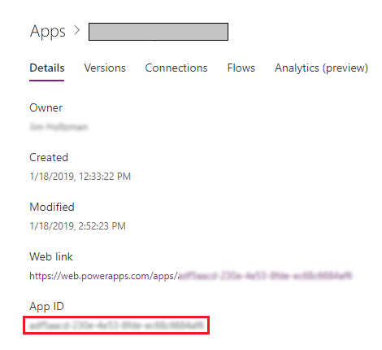

# PowerApps Embedding SDK 

This topic introduces the capabilities of the PowerApps embedding SDKs and shows you how PowerApps can help your customers extend your applications with experiences ranging from creating simple custom forms to adding a feature-rich screens. More information : [Demo on PowerApps embedding SDK](https://mybuild.techcommunity.microsoft.com/sessions/77090?source=sessions#top-anchor)

## What this sample does

This sample uses the PowerApps embedding authoring SDK to create or edit a new canvas app from the host.

## How this sample works

To simulate creating or editing a canvas app from the host via the sample, you need to do the following steps:

### Setup

1. Download or clone the repository so that you have a local copy.
2. Sign in to [PowerApps](https://web.powerapps.com).
3. Click on **Apps** from the left navigation pane and click on **Create an app -> Canvas -> Open -> Browse**, and then import the **Map Address (SDK Build Demo).msapp** file from the repository and click on **File** and **Save**.
4. Once the app is saved, copy the **App ID** value by navigating to [PowerApps](https://web.powerapps.com) home page, click on **Apps**  and select the app that you have created from the list of apps. Click **More Commands(...) -> Details**. Record the **App ID** for later use.
   
    

## How to run this sample

1. Open the sample solution in Visual Studio 2017 and press **F5** to run the sample. 
   - If you want to edit an existing canvas app, click on settings on the top right hand side and enter the **App ID** copied in the previous step and click on **Save**.
   - If you want the Bing Map to render in the canvas app, set the **BingAPIKey** value in the **PowerAppsDetails.js** file located under the **ClientApp -> src -> components** folder and look for the comment **// Set the Bing API here** and set the key.
  
  