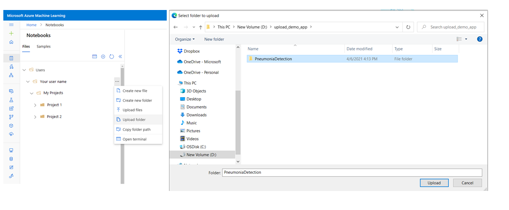
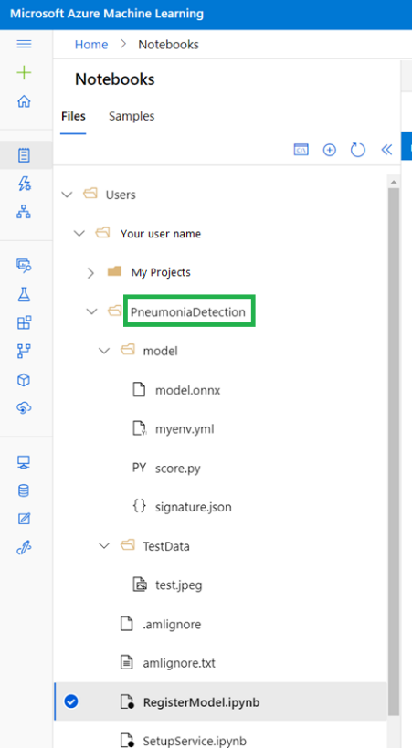
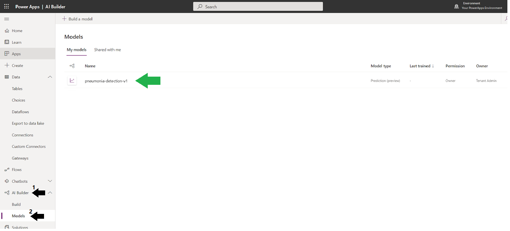
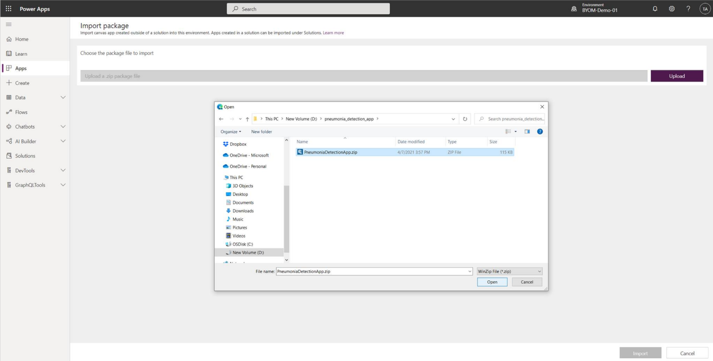
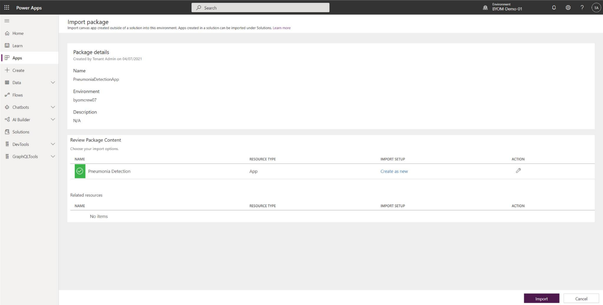
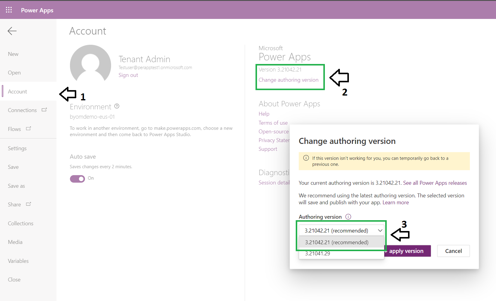
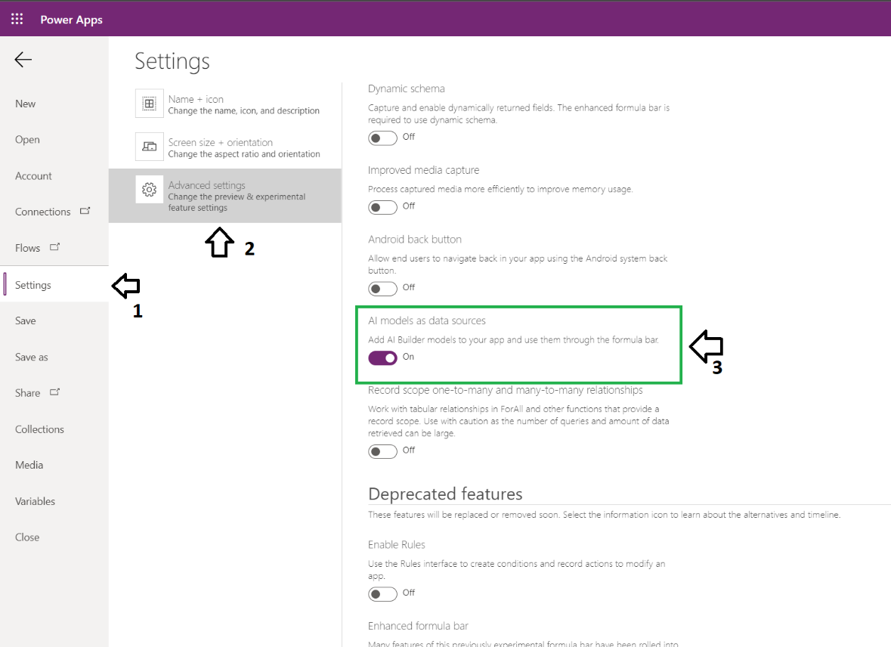
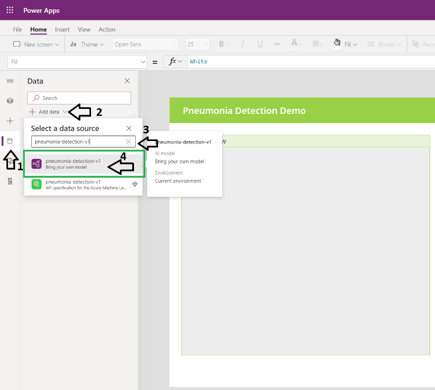
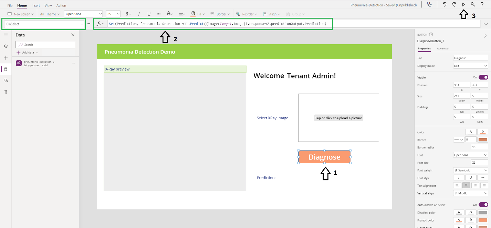
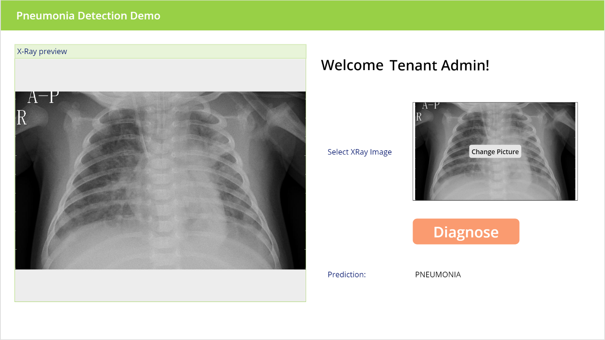

# Bring your own model tutorial (Preview)

AI Builder provides unprecedented ease in deploying AI and ML models in
applications, automation, and against business data. With "bring your own
model", you can deploy *any* model to AI Builder and make it accessible to any
user with access to Microsoft Power Platform or Microsoft Dataverse. In this
article, we will show you how to quickly integrate your own models into AI
Builder and Microsoft Power Apps. You will be able to register a model from
anywhere, but in this tutorial you will be hosting the model in Azure Machine
Learning.

This sample uses an image classification model that was trained with radiology
scans that are labeled as having pneumonia or not. The application you will
integrate in the end shows predictions based on images in the app.

**NOTE**:
-   This is a preview feature.
-   Preview features aren't meant for production use and may have restricted
    functionality. These features are available before an official release so
    that customers can get early access and provide feedback.

## Prerequisites

-   A Power Apps [environment](https://learn.microsoft.com/power-platform/admin/environments-overview).

-   An Azure Machine Learning workspace. Please refer to this
    [documentation](https://learn.microsoft.com/azure/machine-learning/tutorial-1st-experiment-sdk-setup)
    to set your Azure Machine Learning workspace, notebook and a compute to run
    a notebook.

-   The tutorial contents as mentioned in the next section.

## Tutorial contents

The tutorial contains these files and folders:

-   **Pneumonia Detection** folder – a folder to upload to Azure Machine
    Learning containing sample notebooks, a model, and test data

-   **PneumoniaDetectionApp.zip –** a zip file containing a Power Platform
    solution with a sample application where your model will be used

-   **readme.md**: This article.

## Step 1: Create an Azure Machine Learning model endpoint 

First, let us create a model endpoint in Azure Machine Learning. This step is
required if you do not already have a model endpoint to register with AI
Builder.

1.  Go to <https://ml.azure.com> and select the workspace where you want to
    deploy the sample model.

2.  Navigate to the **Notebooks** section.

3.  Select the folder with your username and upload the PneumoniaDetection
    directory from the zip file.

    

4.  You will now have a folder named PnemoniaDetection as highlighted in the
    screenshot below.

    

5.  Open the SetupService.ipynb notebook. If you haven't created a notebook
    compute, use the + button in the notebook window header and create a compute
    to be used for your notebooks. Any compute should work such as a
    Standard_DS2_v2.

6.  Run all the cells in order. Running this notebook will deploy a Pneumonia
    detection model to an Azure Container Instance.

7.  When accessing a resource, you may be prompted to log in with a message that
    looks like this: **"Performing interactive authentication. Please follow the
    instructions on the terminal. To sign in, use a web browser to open the page
    https://microsoft.com/devicelogin and enter the code XXXXXXXXXX to
    authenticate."** To log in, click the link, enter the code, and follow any
    login prompts to continue.

8.  Once you complete all the notebook cells you will have the model deployed as
    a service.

## Step 2: Register the model endpoint with AI Builder

To register the model with AI Builder, follow these steps:

1.  Open the RegisterModel.ipynb notebook. Edit the second cell of the notebook
    to add your Power Platform environment name.

    

2.  Run all the cells to register the deployed Pneumonia detection model with AI
    Builder. During this process you will be prompted to log into AI Builder
    with the following message: **"Performing interactive authentication. Please
    follow the instructions on the terminal. To sign in, use a web browser to
    open the page https://microsoft.com/devicelogin and enter the code
    XXXXXXXXXX to authenticate."** To log in, click the link, enter the code and
    follow any login prompts to continue.

3.  Once you run all the steps successfully, you can view the registered model
    in [Power Apps](https://make.powerapps.com) by choosing the
    appropriate environment if necessary, and selecting **AI Builder** > **Models** in the left pane.

    

## Step 3: Consume AI Builder model in Power Apps canvas app

Great! You have now successfully registered a model endpoint with AI Builder.
This model in AI Builder can be integrated into Power Apps canvas application
and Microsoft Power Automate! The following steps will walk you through setting
up a sample canvas application.

This sample canvas application uses the registered model to predict if a given
patient has pneumonia or not based on the chest x-ray images. The steps below
show how to setup the pneumonia detection application using the sample zip file
provided.

### Step 3.1: Import sample canvas app into Power Apps

1.  Sign in to [Power Apps](https://make.powerapps.com), select **Apps**, and then select **Import Canvas App**.

2.  Upload the PneumoniaDetectionApp.zip when prompted.

    

3.  Your uploaded solution should now be visible as below.

    

### Step 3.2: Integrate the registered model

After importing the sample app into Power
Apps, it's time to integrate the AI model you registered earlier with the
imported canvas app.

1.  Select **Edit** to modify the canvas application.

2.  Validate that you have minimum supported Power Apps version of 3.21042.21 or
    higher. Go to File -\> Account and validate Power Apps version.

    

3.  Enable AI models as data sources. Go to File -\> Settings -\> Advanced
    settings and enable AI models as data sources under experimental features.

    

4.  The below window will pop up. Click on Data -\> Add Data -\>. Select the
    model you registered with AI Builder. Make sure you select the model and not
    the connector (which was also created along with the model when you
    registered).

    

1.  Click on the **Diagnose** button in the app. The formula bar will show up at
    the top. Ensure that the model's name is same as the selected model
    (pneumonia-detection-v1 in this case). Now select run on the top right
    corner to preview the app.

    

2.  Your app in now ready. Click on change picture, upload a test image, and
    click on **Diagnose** to see your app work!

    
