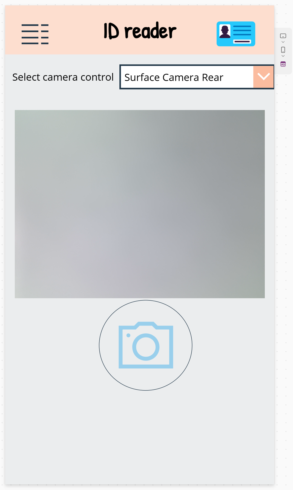

### AI Builder Document identity reader canvas app

This sample allows you to explore a canvas app that extracts information from identity documents, such as a U.S. passport or a French identity card, using a prompt and a Dataverse table.

### Use Case Scenario

Select a camera control in the canvas app.
Capture an image of an identity document using the front or rear camera.
Extract the document's information and output it as a JSON object.
Save the output JSON data as a row in a Dataverse table.

# example:
{
  "Category": "Identity Card",
  "Country Region": "France",
  "Date Of Birth": "13 07 1990",
  "Date Of Expiration": "11 02 2030",
  "Document Number": "D2H6862M2",
  "Document Type": "Identity Card",
  "First Name": "Maëlis-Gaëlle, Marie",
  "Issuing Authority": "République Française",
  "Last Name": "Martin",
  "Nationality": "FRA",
  "Place Of Birth": "Paris"
}

Select a button to update the data output JSON to a row of a Dataverse table

### Try it out!

# Prerequisite: 

Active Power Apps plan
AI Builder credits
Dataverse environment

Sign in to [Power Automate](https://make.powerautomate.com/). or [Power Apps](https://make.powerapps.com/).
On the left navigation pane, select **Solutions**, select **Import Solution**
Select **Browse** for the solution file to import "Documentidentityreader_1_0_0_1.zip", select **Next**, select **Import**
(it may takes a few minutes to import the solution)

On the left navigation pane, select **Tables**, you should have a table called "Table document identity"
On the left navigation pane, select **... More**, select **AI hub**, select **Prompts**, select **My Prompts**, you should have a prompt called 'Document identity reader'
On the left navigation pane, select **Apps**, select **My apps**, you should have a canvas app called 'Document identity reader v1'

You can now run the app to try it out.

### Helpful links

https://aka.ms/PromptJsonOutput
https://aka.ms/MultiModalPrompts

### Solution information

Document identity reader 1.0.0.1
Default Publisher
Unmanaged solution

