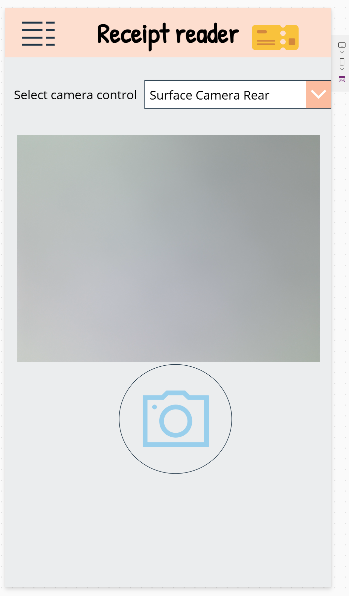

### AI Builder Receipt reader

This sample demonstrates how to use a canvas app to extract information from a receipt with the help of a prompt and a Dataverse table.

### Use Case Scenario

Select a camera control within the canvas app.
Capture an image of a receipt using either the front or rear camera.
Generate the receipt data as a JSON object.
Save the output JSON data as a row in a Dataverse table.

# example:
{
  "Merchant name": "PORT DE NICE",
  "Transaction date": "19/09/22",
  "Transaction time": "09:17:24",
  "Total": "4,50",
  "Total currency code": "EUR"
}

Select a button to update the data output JSON to a row of a Dataverse table

### Try it out!

# Prerequisite: 
 
Active Power Apps plan
AI Builder credits
Dataverse environment

Sign in to [Power Automate](https://make.powerautomate.com/). or [Power Apps](https://make.powerapps.com/).
On the left navigation pane, select **Solutions**, select **Import Solution**
Select **Browse** for the solution file to import "Receiptreader_1_0_0_1.zip" , select **Next**, select **Import**
(it may takes a few minutes to import the solution)

On the left navigation pane, select **Tables**, you should have 2 tables called "Table receipt" and "World Currencies"
On the left navigation pane, select **... More**, select **AI hub**, select **Prompts**, select **My Prompts**, you should have a prompt called 'Receipt reader'
On the left navigation pane, select **Apps**, select **My apps**, you should have a canvas app called "Receipt Reader v1"

You can now run the app to try it out.

### Helpful links

https://aka.ms/AIBuilderDataGrounding
https://aka.ms/PromptJsonOutput
https://aka.ms/MultiModalPrompts

### Solution information

Receipt reader 1.0.0.1
Default Publisher
Unmanaged solution

