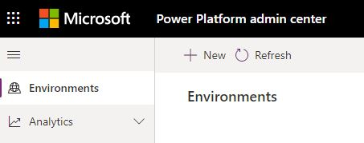
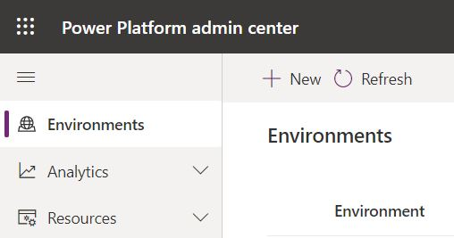
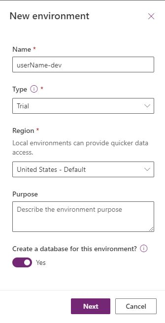
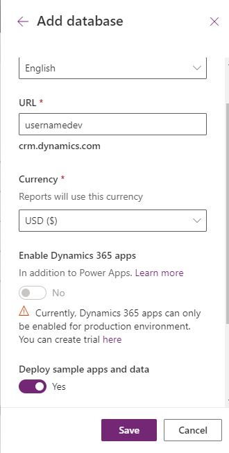
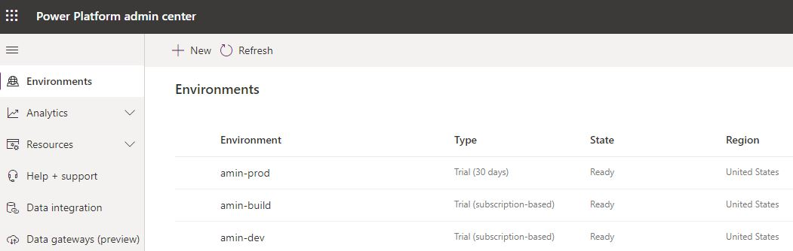
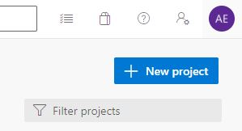
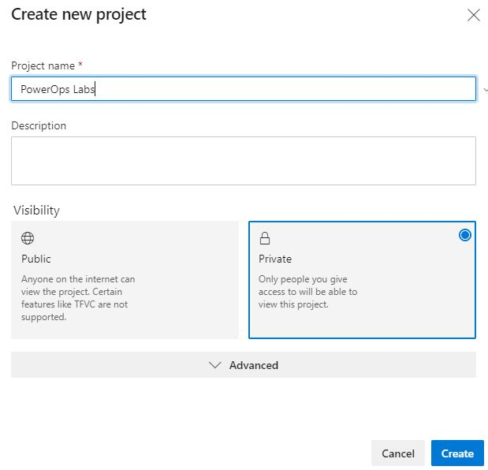
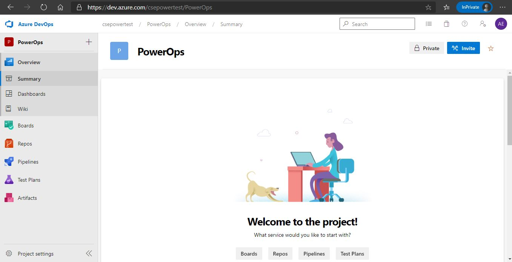
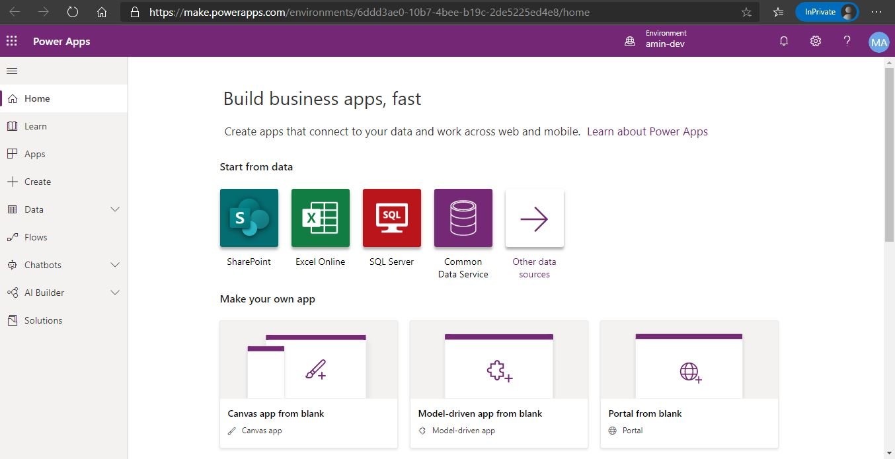
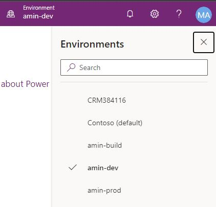

# Power Apps Lab
## Module 0: Pre-Lab Setup and Review using Azure DevOps
Last updated: February 15, 2021
Authors: Per Mikkelsen, Shan McArthur, Evan Chaki, Amin Espinoza

### Overview

This hand-on lab will give you an opportunity to get hands on with the best practices to get your app
into source control, generate a managed solution from Source (your build artifact) and finally deploy the
app into another environment. You will need access to 3 Common Data Service environments
(Development, Build & Production) along with Azure DevOps to automate deployments.

### Pre-Lab Setup:

You will need to create three environments in your demo or customer tenant. To do this follow these
instructions:

1. Login to a tenant that you have access to and that minimum 3GB available capacity which is required to create 3 environments.

2. Go to [https://admin.powerplatform.microsoft.com/](https://admin.powerplatform.microsoft.com/), this will take you to the *admin center*.

3. Select **environments** in the navigation area.

4. Select **+ New** to create your first new environment.

5. The first environment should be named **Your Name – dev**, set the region to **United States (default)**, set the Environment type to **Production** (if available) if not use **Trial**. Select the option to create a database for the new environment.

6. In next section to create a database you can select a language, and an URL, this URL has to be unique, also select the currency, and select **Yes** when prompted to deploy sample apps and data.

7. Your development environment has been created, follow steps 4 – 6 above to create a second environment called **Your Name – build**, and then finally, create a third environment called **Your Name – prod** – NOTE the third environment can be a trial environment type.

8. Now that you have the environments that we will need for this lab, it's time to go to Azure DevOps. Create a DevOps project by going to [https://dev.azure.com](https://dev.azure.com) and selecting **Sign into Azure DevOps**. Select **+ Create project**. 

9. Create a new project name called **Your name - DevOps Project**, make it a Private project and select **Create**.

10. Your DevOps project has now been created, please note the URL on the top for your project and bookmark it or save it locally.

11. You are now ready to begin the ALM Hands-on Lab.

### ALM Hands-on Lab Overview

During this lab you will use the account, login, and environments you created in the previous steps. You will get hands-on with the full set of Application Lifecycle Management (ALM) capabilities for the Power Platform. Learn how to use the key concepts that allow customers and partners to manage solutions and deploy them across environments. Additionally, get up to speed with the details of canvas apps and flows in solutions.

1. Let's get familiar with the environments that you created (in the pre-lab) or were created for you.

2. Go to [https://admin.powerplatform.microsoft.com/environments](https://admin.powerplatform.microsoft.com/environments) to view the environment you have access to.

3. You will see your environments, one with dev in the name, one with build in the name and a third with prod in the name.

4. We will use these environments as our primary environments during the lab. Your user will have the **System Administrator** Common Data Service role for all environments giving you full access to the environment.

5. In a new tab open [https://make.powerapps.com](https://make.powerapps.com).

6. In the header, you will see a way to switch environments to move between your different environments.

7. When you change to a new environment Power Apps.com will also change to show only content relevant to that environment. Both environments contain a Common Data Service database. This allows you to leverage the Common Data Service solution infrastructure to move app, entities, code and other resources from one environment to another.

8. Select **Solutions** in the navigation.

9. Solutions are how customizers and developers author, package, and maintain units of software that extend Dataverse. Customizers and developers distribute solutions so that organizations can use Dataverse to install and uninstall the app(s) defined in the solution. In the next Module you will learn how to create a new solution.