# Power Apps Hands-on Lab
## Module 1: Building Basic Model-driven Common Data Service Application for Deployment Using Azure DevOps
Last updated: February 15, 2021
Authors: Per Mikkelsen, Shan McArthur, Evan Chaki, Amin Espinoza

In this lab you will be creating a basic Model-driven Dataverse application to use with Module 2 of the lab to automate the application lifecycle management (ALM) of the application.

1. Navigate to [https://make.powerapps.com](https://make.powerapps.com) and sign in with your credentials. Click the environment selector dropdown the header and select your development environment.

2. Click the **Solutions** area in the left navigation then click the **New Solution** button to create a new solution.

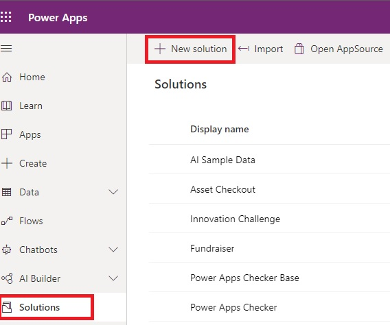

3. In the side panel that appears, enter a name for the application and click the dropdown for the publisher and click the **Add Publisher** option.  
**Note**: The solution publisher specifies who developed the app. For this reason, you should create a solution publisher name that's meaningful. Furthermore, the solution publisher includes a prefix, which helps you distinguish system components or components introduced by others and is also a mechanism to help avoid naming collisions. This allows for solutions from different publishers to be installed in an environment with minimal conflicts.

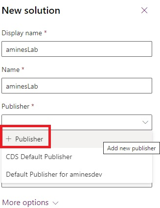

4. A new window will pop up. If a window does not pop up, check your popup blocker settings. For the purpose of this lab, enter your **ALMLab** for the display name, name and prefix and click **Save and Close**.

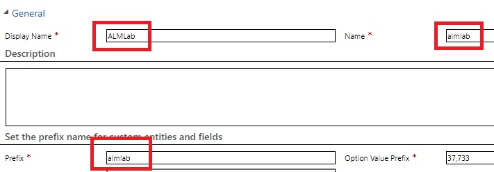

5. On the new solution panel, select the publisher that you just created, give the application a version number, and click **Create** to create a new unmanaged solution in the environment.

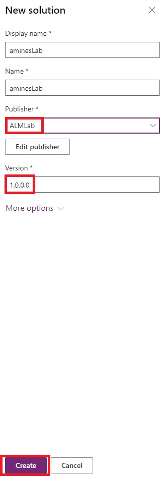

6. In the solutions list, select the solution you just created and click the **Edit** button.

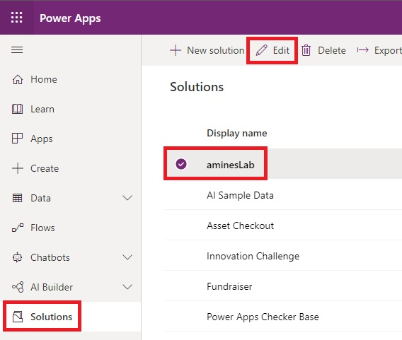

7. Your new solution will be empty, and you need to add components to it. In this lab we will create a custom entity. Click the **New** dropdown from the top navigation and select Table.

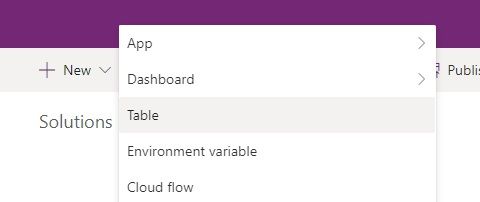

8. Enter a display name and plural name. The system will fill out the table name and other fields for you. Click **create** to create the table.

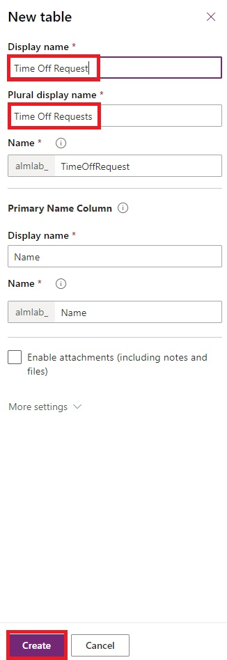

9. Once your table is created, click the solution name again to go back to the solution view to add another component.

10. Click the New **dropdown**, then App, and **Model-driven app**.

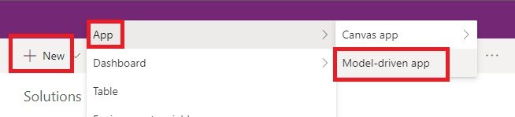

11. Enter an application name and click the **Done** button.

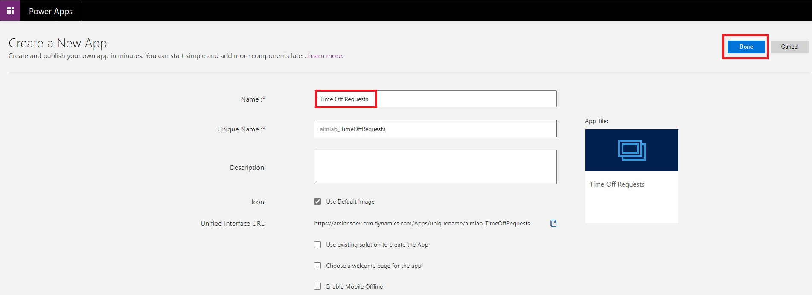

12. In the application designer, click the **Site Map** to edit it.

13. In the site map editor, select the **New Subarea** to get its current properties.

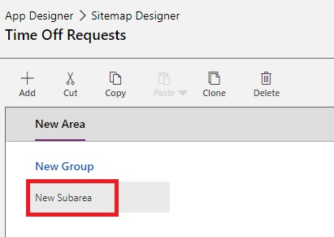

14. Select the Entity dropdown and select your custom table to add to the sitemap.

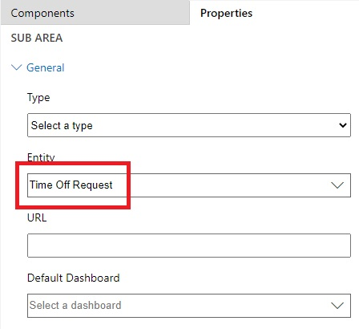

15. Click **Save**, then **Publish**, then **Save and Close** to go back to the application designer.

16. Click **Save** then Validate to validate the application.

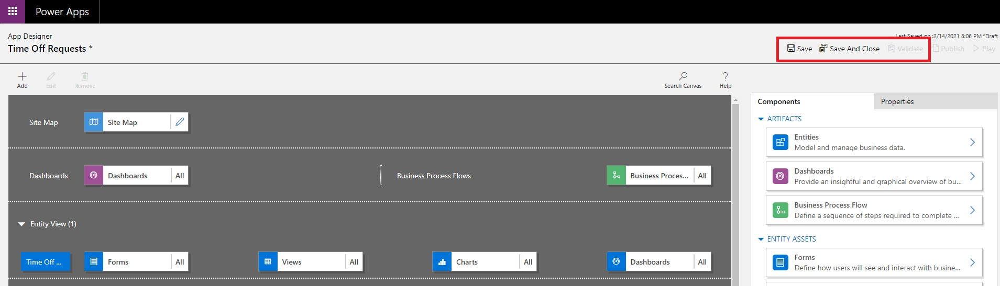

17. You should see one warning. View the warning, then click **Publish** then **Play**.

18. This will take you to the application so that you can see how it looks. You can use the application and close the tab when you are satisfied.

