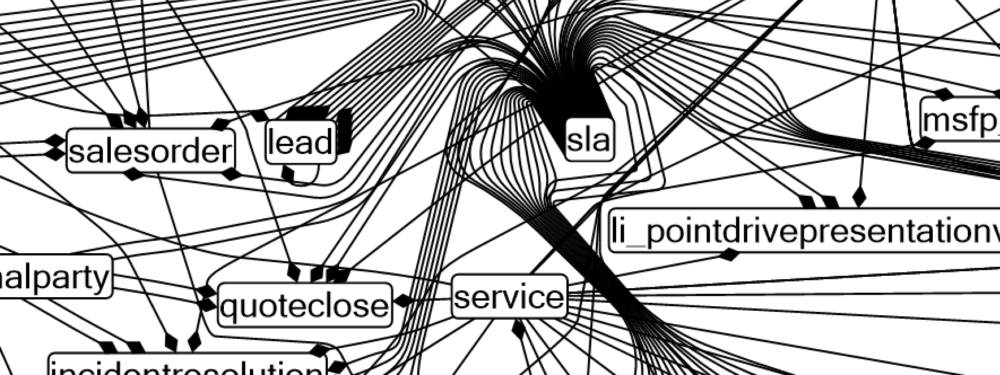
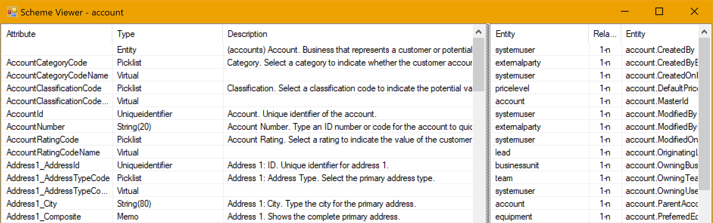
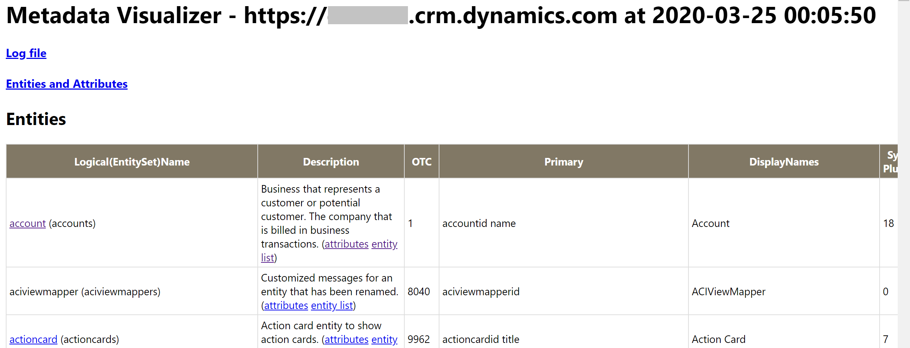

# Metadata Visualizer

Metadata Visualizer (MetaViz) downloads the metadata of your Dynamics 365 Customer Engagement or Microsoft Dataverse organization to visually display the entities, entity relationships, and registered plug-in information.

## What can you do with MetaViz?

The application can download entity, plug-in, and custom workflow activity metadata information from your organization into a text file and you can browse that data offline.
Since this metadata information is downloaded into readable files you can: keep it in a repo, compare metadata of different environments, track changes to metadata, let somebody check the information without giving them access to the organization, and more.

Below is a description of the files that are generated when you download an organization's metadata.

- Trigger definitions (HTML file)

Registered synchronous and asynchronous plug-ins and custom workflow activities (and their filtering attributes) are dumped into the html file.
You can find what activity or plug-in is registered on an entity to trace what code will be triggered when a core system operation (create, update, delete, etc.) occurs.

- Entity definitions (text file)

Localized/customized display names for all attributes, descriptions, and data-types across all entities are dumped into a text file.
You can compare the scheme across environments and/or releases easily by using your preferred text comparison (differences) tools.

- Entity relationship diagram (JSON file)

The ER Viewer allows you to visually browse the relationships across your chosen entities.
You can select specific entities and check their relationships in a visual diagram.

## How to use the application

### Building and running the application

1. Load the solution into Visual Studio, build, and then run the program.
2. After the download dialog is displayed, enter your target organization URL in the provided field of the dialog.
3. When prompted, specify a folder where the organization's metadata is to be stored.
4. When prompted, provide your organization logon information.
5. The organization metadata download will start, and this may take several minutes.
6. The entity relationship (ER Viewer) window opens and displays an initial (default) diagram of the pre-selected entities.
7. Resize the window as appropriate.
8. Select the zoom (+) icon in the toolbar to enlarge the diagram and the pan (hand) icon to pan around the view.
9. Hover the cursor over the other icons in the toolbar to see what other functionality is available.

### Changing the entity diagram

1. In the ER Viewer, select **Entities** > **Clear**.
2. In the left panel select any entities that you want to be rendered in the diagram (i.e., account, contact, activityparty).
3. Select **Diagram** > **Draw Selected Entities** to view those entities and their relationships.
4. Next, select **Diagram** > **Draw Related Entities** to view all other entities that have a relationship with the entities specified in step #2.

### Viewing entity metadata

1. In the ER Viewer, hover the cursor over an entity in the entity diagram to view a summary description.
2. Select the entity in the diagram to display the Schema Viewer showing the entity's metadata (attributes and relationships).
3. Select another entity in the diagram to now view its metadata in the Schema Viewer window.
4. Logon to your organization using your default internet browser.
5. In the ER Viewer window, select an entity and choose **Selected Entity** > **Copy URL**.
6. Paste the URL into your browser to see the list of records for that entity. Note that you may need to choose a different view in the browser page other than the default view to see the records for that entity.

### Viewing plug-in and custom activity registrations

1. Logon to an organization in your default internet browser.
2. In the ER Viewer, select **Diagram** > **Trigger information**. A browser window or tab will open displaying entity information and registered plug-in/custom workflow activity information.
3. Select an entity link (blue underlined text) to jump to the plug-in/custom activity information for that entity.
4. Select other links to see what kind of information is available from that browser page.

## FAQs

Please check this FAQ section for further information on how this application works.

**Q. How can I specify the entities rendered in the ER Viewer diagram?**

You need to select a list of entities you want to use.

1. Choose **Entities > Clear** to de-select all entities.
2. Select (check) the entities you are interested in viewing.
3. Use either **Diagram > Draw Selected Entities** or the **Draw Related Entities** menu items.

The **Draw Selected Entities** menu automatically expands the selection to the related entities to the ones currently selected.
You can copy and paste the list of entities selected by choosing **Entities > Copy** and **Entities > Paste** menu items.

**Q. How to add related entities to/remove the entity from the diagram?**

Click the entity in the diagram and then choose the **Selected Entity > Remove** menu item. In the same way you can perform different operations such as **Select Related Entities** on the selected entity.

**Q. What library is used to render the ER Viewer diagram?**

[Microsoft Automatic Graph Layout](https://www.microsoft.com/research/project/microsoft-automatic-graph-layout/) (MSAGL). *MSAGL is a .NET tool for graph layout and viewing. It was developed in Microsoft by Lev Nachmanson, Sergey Pupyrev, Tim Dwyer and Ted Hart.*
