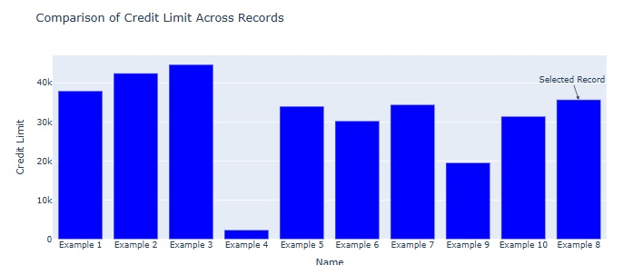
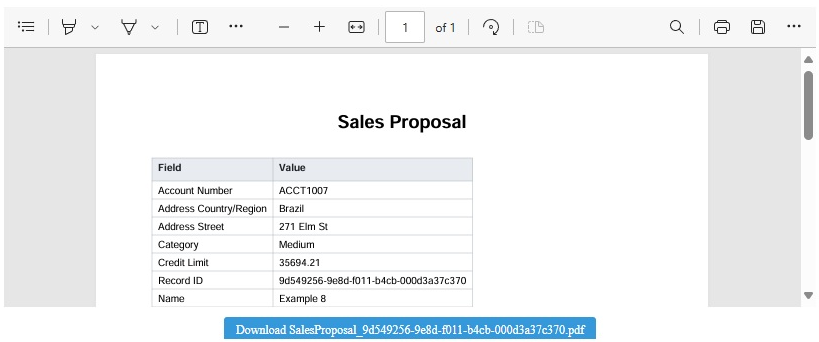
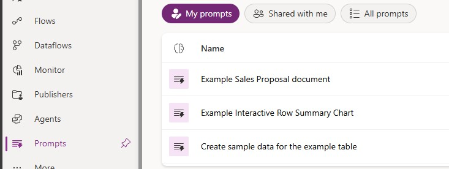
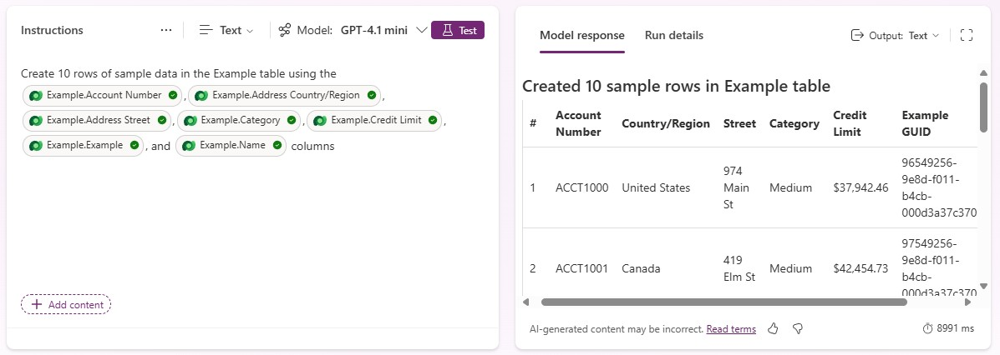
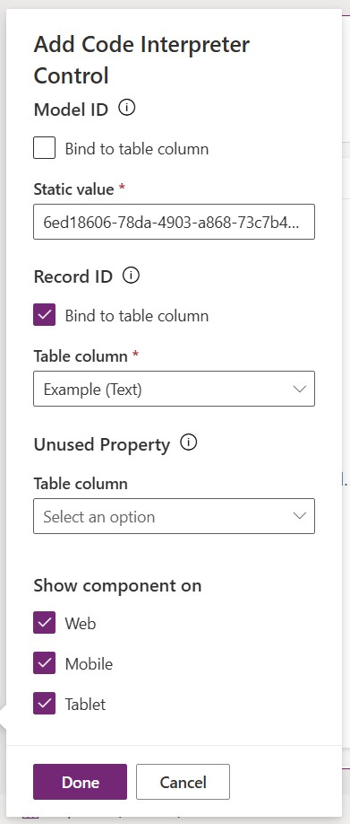

---
languages:
  - typescript
products:
  - power-platform
  - power-apps
  - dynamics-365
page_type: sample
description: "This sample demonstrates a Power Apps Component Framework (PCF) control that integrates with Code Interpreter enabled prompts. It can display interactive data visuals in HTML and Javascript or create file previews and downloads for PDF, Word, PowerPoint and Excel documents."
---
# Code interpreter sample

This sample demonstrates a Power Apps Component Framework (PCF) control that integrates with Code Interpreter enabled prompts. It can display interactive data visuals in HTML and Javascript or create file previews and downloads for PDF, Word, PowerPoint and Excel documents.

## Features

- **Code Interpreter Integration**: Seamlessly integrates with Code Interpreter enabled prompts that generate Word, PowerPoint, Excel, or PDF documents or interactive data visuals in HTML and Javascript.
- **Interactive Data Visuals**: Display interative charts and graphs in Html and Javascript.
   
- **File Preview**: Native preview support for PDF, Word (.docx), and Excel (.xlsx) documents.
- **Download Support**: Direct download links for all supported file types.
   

## Compatibility

This sample works for model-driven apps in Dataverse environments with AI capabilities and code intepreter enabled.

## Applies to

[Power Apps component framework](https://learn.microsoft.com/power-apps/developer/component-framework/overview)

Get your own free development tenant by subscribing to [Power Apps Developer Plan](https://learn.microsoft.com/power-platform/developer/plan).

## Version history

| Version | Date            | Comments                                          |
| ------- | --------------- | ------------------------------------------------- |
| 1.0     | September 19, 2025 | Initial release with PDF, Word, and Excel preview |

## Try this sample

You can try this sample without building it or writing any code. In the `solutions` folder of this sample find the following managed solution files:

|Solution|Description|
|---|---|
|[solutions/CodeInterpreterControlSolution.zip](solutions/CodeInterpreterControlSolution.zip)|Contains the PCF control for the code in this sample.|
|[CodeInterpreterSample_1_0_0_0_managed.zip](solutions/CodeInterpreterSample_1_0_0_0_managed.zip)|Contains items to enable demonstrating the control without depending on existing tables:<br />- A custom table named `sample_example`.<br /><br />- A model-driven application that includes data from the `sample_example` table.<br /><br />- Three code interpreter enabled AI models (prompts) that reference columns from the `sample_example` table.|

1. Download and [Import](https://learn.microsoft.com/power-apps/maker/data-platform/import-update-export-solutions) the `CodeInterpreterSample_1_0_0_0_managed.zip` and `CodeInterpreterControlSolution.zip` into your environment.
1. In [Power Apps](https://make.powerapps.com/) select **AI hub**, and then **Prompts**.
1. Locate the prompt named  **Create sample data for the example table** and open it.

   

1. Click **Test** and observe the response to see sample records being adding into the **Example table** through code interpreter.

   

1. In [Power Apps](https://make.powerapps.com/) select **Apps** and locate the model-driven app named  **Code Interpreter example app**.
1. Click the pencil icon to edit the app.
1. In the app, locate the **Examples form** and click the pencil icon to edit the form.
1. Select the section of the form with the title **Add PCF components here**.
1. Select **Component** from the menu and select **Get More components** at the bottom of the screen.
1. In the **Get More components** fly out, search for 'Code Interpreter Control'.
1. Select the control and select **Add**. You will now see the **More components** section with the **Code Interpreter Control** in the **Components** pane.
1. Drag **Code Interpreter Control** to the **Add PCF components here** section.
1. In the **Model ID** field, enter either `b412c9a3-1b4f-45c4-956d-33bd4412be33` for the **Example Sales Proposal document** AI model or `6ed18606-78da-4903-a868-73c7b462b336` for the **Example Interactive Row Summary Chart** AI model.

   **Note**: These ID values are known because they are set in the **Code Interpreter Sample** solution you installed in the first step. If you use a different ai model, you will need to query the [AI Model (msdyn_AIModel) table](https://learn.microsoft.com/power-apps/developer/data-platform/reference/entities/msdyn_aimodel) to get the `msdyn_aimodelid` value to use instead.

1. For **Record ID** click **Bind to table column** and choose **Example (Text)** and click **Done**

   

1. Click **Save and publish** then **Back**
1. Click the play button in the upper right corner.
1. Select one of the **Active Example** records and observe code interpreter display either an interactive chart or document preview + download based on the **Model ID** chosen above.

## Build this sample

Like all PCF samples, you can modify and build this sample.

### Prerequisites

- [Install the Microsoft Power Platform CLI](https://learn.microsoft.com/power-platform/developer/cli/introduction)
- Node.js and npm installed
- Dataverse environment with AI Builder capabilities
- A Code Interpreter enable prompt with a case-sensitive single input named **RecordId** in your environment. [Review Code Interpreter documentation here](https://learn.microsoft.com/microsoft-copilot-studio/code-interpreter-for-prompts)

## Dependencies

This project uses the following npm packages:

```json
{
 "mammoth": "^1.9.1",
 "xlsx": "^0.18.5"
}
```

## Configuration

This control exposes the following properties to

|Property|Description|
|---|---|
|**Model ID**|ID of the Code Interpreter enabled AI model.|
|**Entity ID**|ID of the current record to process. Bind this to the unique identifier of your table. For example: Account (Text)|

## Build a solution with this sample

Follow the steps in the [README.md](../README.md) to generate solutions containing the controls so you can import and try the sample components in your model-driven or canvas app.

## Run the sample locally

To try this sample locally, follow these steps:

1. Clone the repository and navigate to the `CodeInterpreterControl` directory:

   ```powershell
   git clone https://github.com/microsoft/PowerApps-Samples
   cd PowerApps-Samples\component-framework\CodeInterpreterControl
   ```

2. Install dependencies:

   ```powershell
   npm install
   ```

3. Build the project:

   ```powershell
   npm run build
   ```

4. Test locally:

   ```powershell
   npm start
   ```

5. Deploy to your Dataverse environment:

   ```powershell
   pac pcf push --publisher-prefix <your-prefix>
   ```

## Enable 'Code Interpreter'

Follow the instructions to enable Code Interpreter in the [Administration of code interpreter](https://learn.microsoft.com/microsoft-copilot-studio/code-interpreter-for-prompts#administration-of-code-interpreter)

## Create a custom Code Interpreter prompt the sample can use

1. Go to [Copilot Studio](https://copilotstudio.microsoft.com/)
1. Select your environment
1. Follow the instructions to [Enable Code Interpreter in a prompt](https://learn.microsoft.com/microsoft-copilot-studio/code-interpreter-for-prompts#enable-code-interpreter-in-prompt-tool-within-an-agent)
1. In the prompt editor, select **+ Add content**
1. Select **Input** of **Text**
1. Set name to **RecordId** (case-sensitive). Set **Sample data** to a single valid record id.
1. Finish creating a prompt that either displays interactive data visuals in HTML and Javascript or creates a PDF, Word, PowerPoint or Excel document (see examples below). Don't forget to include Knowledge of relevant columns (**+ Add content** > **Knowledge** > **Dataverse** ...)
1. Try it by clicking **Test** and viewing the output in **Model response** box.
1. Once you're satisfied click **Save**

## Related information

- [Power Apps Component Framework](https://learn.microsoft.com/power-apps/developer/component-framework/overview)

## Disclaimer

**THIS CODE IS PROVIDED _AS IS_ WITHOUT WARRANTY OF ANY KIND, EITHER EXPRESS OR IMPLIED, INCLUDING ANY IMPLIED WARRANTIES OF FITNESS FOR A PARTICULAR PURPOSE, MERCHANTABILITY, OR NON-INFRINGEMENT.**
