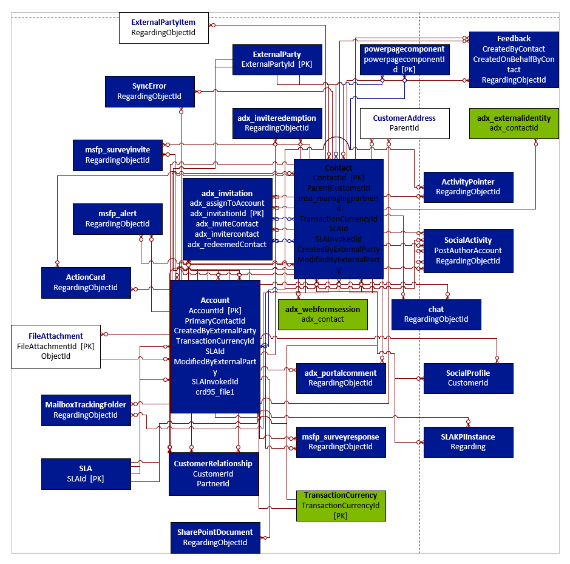

# Use metadata to generate entity diagrams

Visual representation of metadata can be very useful, especially when describing the relationship between entities in the system. You can use the Metadata Diagram application to generate entity relationship diagrams. You can create a simple diagram that shows a relationship for just one entity or a more complex diagram that includes dozens of related entities, including custom and system entities.

## What this sample does

This sample application generates an entity relationship diagram for one or more entities specified as command arguments. The output is a file in the Microsoft Visio format.

The following entity diagram was generated using the compiled Metadata Diagram application. The diagram shows the relationship between the `account` entity, the `contact` entity, and other entities in the system. The names shown are the logical entity names. If there are multiple relationships between the same two entities, only one line is drawn in the diagram for simplicity.



> [!TIP]
> Always specify one or more entities as command line arguments. Specifying no entities results in a diagram of all entities in the target environment. The resulting diagram takes a long time to generate and is too complex to be useful. Specifying fewer entities in the diagram produces better results.

## Prerequisites

1. Download and install Microsoft Visio. A trial installation should be sufficient.
1. Launch the Visual Studio 2022 (or later) installer to verify that the **Visual Studio Tools for Office** component is installed, or install it. You can also download [Visual Studio 2010 Tools for Office Runtime](https://www.microsoft.com/en-us/download/details.aspx?id=105522.&msockid=0eb330f6bc236d9e21a425cabd0e6c09) manually.

## How to run this sample

You can run the sample two different ways: from within Visual Studio, or in a Command window.

## Option 1: Run sample using Visual Studio

1. In File Explorer, select the app's solution (*.sln) file to launch Visual Studio.
1. Add one or more entity names in the project properties by navigating to **Project** > **GenerateEntityDiagram Properties** > **Debug** and adding one or more entity logical names to the **Command line arguments** field. Use entity names that exist in your test environment.
1. Edit the project's `appsettings.json` file, and replace the example URL value with the actual  URL value of your target environment.
1. Run the application by choosing **Start** in the Visual Studio toolbar.

## Option 2: Run sample from a Command window

   1. Compile the app if it is not already compiled.
   1. Edit the project's `appsettings.json` file, and replace the example `Url` value with your target Dataverse environment URL.
   1. Open a Command window, setting the working directory to the project's folder.
   1. Enter a command in this format to run the app.

      ```cmd
      cd bin/Debug
      GenerateEntityDiagram.exe [entity1, entity2, ...]
      ```

## Results

The first entity name is used to name the generated Visio file. For example, if the first entity name program argument is `account`, you find the generated diagram called `account.vsd` in your `bin/Debug` project folder or the current working folder after running the application.

## Related information

- [Use metadata to generate entity diagram](https://learn.microsoft.com/dynamics365/customer-engagement/developer/use-metadata-generate-entity-diagrams)
- [Use connection strings in XRM tooling to connect to Microsoft Dataverse](https://learn.microsoft.com/power-apps/developer/data-platform/xrm-tooling/use-connection-strings-xrm-tooling-connect).
