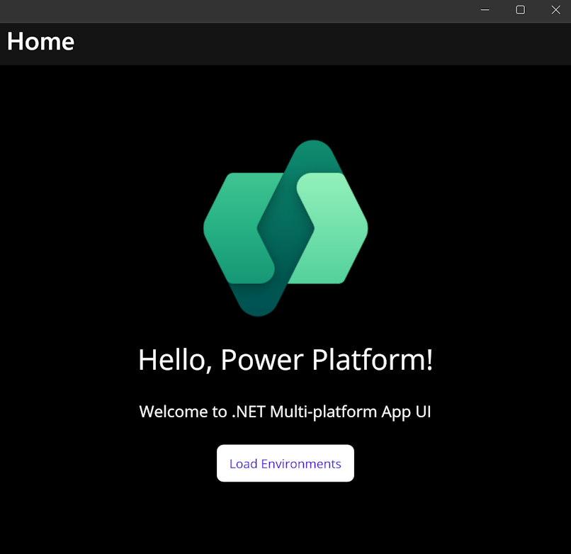
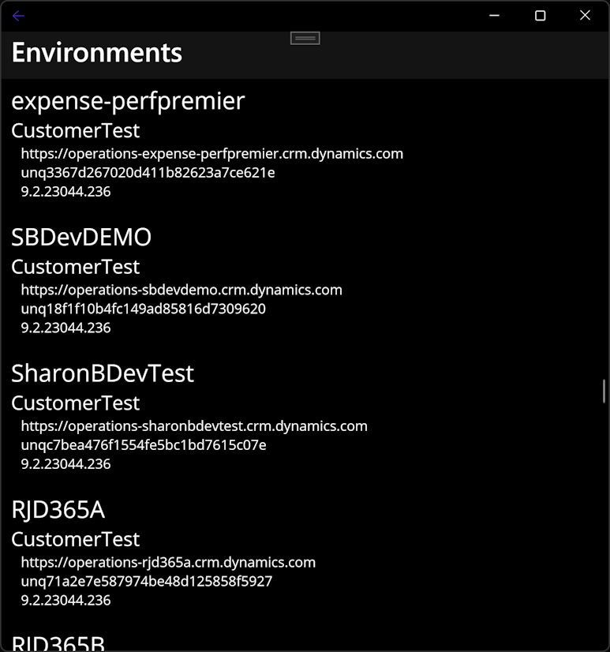

# DataverseMauiApp example app

This is an example showing:

- [MAUI (Multi-platform App UI)](https://dotnet.microsoft.com/en-us/apps/maui) app using .NET 8
- Single Sign On using [MSAL (Microsoft Authentication Library) WAM (Web Account Manager)](https://learn.microsoft.com/en-us/entra/msal/dotnet/acquiring-tokens/desktop-mobile/wam) for Microsoft accounts
- Using the Dataverse [Global Discovery Web API](https://learn.microsoft.com/en-us/power-apps/developer/data-platform/discovery-service) to get list of Dataverse environments

welcome             |  environments
:------------------:|:-------------------------:
  |  
