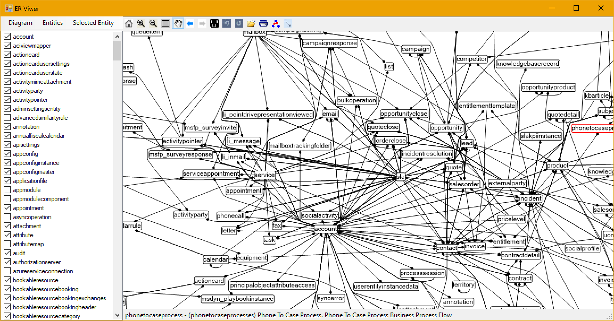
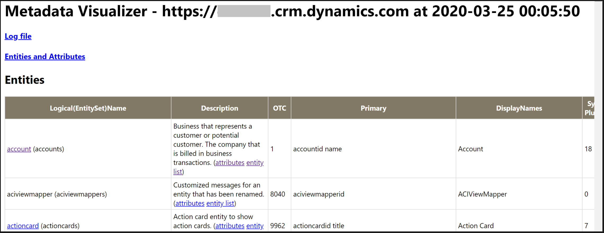

# Metadata Visualizer

Metadata Visualizer (MetaViz) downloads the metadata of your Dynamics 365 Customer Engagement or Microsoft Dataverse organization to visually display the entities, entity relationships, and registered plug-in information.

## What can I do with MetaViz?

The application can download entity, plug-in, and custom workflow activity metadata information from your organization into a text file and you can browse that data offline. Since this metadata information is downloaded into readable files you can:

- Keep the metadata in a repo
- Compare metadata of different environments
- Track changes to metadata
- Let somebody check the information without giving them access to the organization

### Generated files

Here's a description of the files generated when you download an organization's metadata.

- **Trigger definitions (HTML file)**

  Registered synchronous and asynchronous plug-ins and custom workflow activities (and their filtering attributes) are dumped into the HTML file. You can find what activity or plug-in is registered on an entity to trace what code is triggered with a core system operation (create, update, delete).

- **Entity definitions (text file)**

  Localized/customized display names for all attributes, descriptions, and data-types across all entities are dumped into a text file. You can compare the schema across environments and/or releases easily by using your preferred text comparison (differences) tools.

- **Entity relationship (ER) diagram (JSON file)**

  The ER Viewer allows you to visually browse the relationships across your chosen entities. You can select specific entities and check their relationships in a visual diagram.

## How to use the application

### Build and run the application

1. Load the solution into Visual Studio, build, and then run the program.
2. After the download dialog is displayed, enter your target organization URL in the provided field of the dialog.
3. When prompted, specify a folder where you want to store the organization's metadata.
4. When prompted, provide your organization sign-in information.
5. The organization metadata download starts. The download might take several minutes.
6. The entity relationship (ER Viewer) window opens and displays an initial (default) diagram of the pre-selected entities.
7. Resize the window as appropriate.
8. Select the zoom (+) icon in the toolbar or scrollwheel on your mouse to enlarge the diagram and the pan (hand) icon to pan around the view.
9. Hover the cursor over the other icons in the toolbar to see what other functionality is available.

### Change the entity diagram

1. In the ER Viewer, select **Entities** > **Clear**.
1. In the left panel select any entities that you want to be rendered in the diagram (for example account, contact, or activityparty).
1. Select **Diagram** > **Draw Selected Entities** to view those entities and their relationships.
1. Select **Diagram** > **Draw Related Entities** to view all other entities that have a relationship with the entities you chose in step #2.

### View entity metadata

1. In the ER Viewer, hover the cursor over an entity in the entity diagram to view a summary description.
1. Select the entity in the diagram to display the Schema Viewer showing the entity's metadata (attributes and relationships).
   
1. Select another entity in the diagram to view its metadata in the Schema Viewer window.
1. Sign in to your organization using your default internet browser.
1. In the ER Viewer window, select an entity and choose **Selected Entity** > **Copy URL**.
1. Paste the URL into your browser to see the list of records for that entity.
   > [!NOTE]
   > You might need to choose a different view in the browser page other than the default view to see the records for that entity.

### Viewing plug-in and custom activity registrations

1. Sign in to an organization in your default internet browser.
1. In the ER Viewer, select **Diagram** > **Trigger information**. A browser window or tab opens displaying entity information and registered plug-in/custom workflow activity information.
1. Select an entity blue link to jump to the plug-in/custom activity information for that entity.
1. Select other links to see what kind of information is available from that browser page.

## FAQs

### Can I choose the entities in the ER Viewer diagram?

You can select a list of entities you want to use.

1. Choose **Entities > Clear** to deselect all entities.
1. Check mark the entities you want to view.
1. Use either **Diagram > Draw Selected Entities** or the **Draw Related Entities** menu items.

   The **Draw Selected Entities** menu automatically expands the selection to the related entities to the ones currently selected. You can copy and paste the list of entities selected by choosing the **Entities > Copy** and **Entities > Paste** menu items.

### How do I add or remove related entities in the diagram?

Select (check) the entity in the diagram and then choose the **Selected Entity > Remove** menu item. You can perform other operations choosing **Select Related Entities** on the selected entity.

### What library is used to render the ER Viewer diagram?

[Microsoft Automatic Graph Layout](https://www.microsoft.com/research/project/microsoft-automatic-graph-layout/) (MSAGL).

> [!NOTE]
> MSAGL is a .NET tool for graph layout and viewing. This tool was developed at Microsoft by Lev Nachmanson, Sergey Pupyrev, Tim Dwyer and Ted Hart.

## Version history

04-06-2021

- Added the global plug-in in the report.
- Added the workflow activities registration status in the reports.
- Improved the registration status message.
- Added the categories for plug-in and workflows in the reports.
