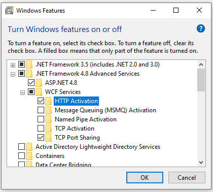

# How to run Microsoft Dataverse samples?

1. Download or clone the repo so that you have a local copy.
1. (Optional) Edit the dataverse/App.config file to define a connection string specifying the Dataverse instance you want to connect to.
2. Open the sample solution in Visual Studio and press F5 to run the sample.
    - If you have specified a connection string in dataverse/App.config, any sample you run will use that connection information.
    - If you haven't specified a connection string in dataverse/App.config file, a dialog ([XRM tooling common login control](https://learn.microsoft.com/powerapps/developer/common-data-service/xrm-tooling/use-xrm-tooling-common-login-control-client-applications)) will open each time you run the sample and you will need to enter information about which Dataverse instance you want to connect to and which credentials you want to use. This dialog will cache previous connections so that you can choose a previously used connection. See the **Known issue** and its workaround later for this scenario.

The samples in this repo that require a connection to a Dataverse instance to run will include a linked reference to the dataverse/App.config file.
    
## Known issue 

With the recent changes to .NET Framework, an exception is thrown when a sample tries to open the XRM tooling common login control dialog. As a workaround for the time being, do one of the following:
- Specify a connection string in dataverse/App.config to run the samples.
- Enable **HTTP Activation** on your computer where you are running the samples, and then run the sample without specifying a connection string in dataverse/App.config.
    
    
    
This issue will be resolved in a future update when we distribute the updated assemblies through our [NuGet package](https://www.nuget.org/packages/Microsoft.CrmSdk.XrmTooling.WpfControls/). 

