# Power Platform Enterprise Policies PowerShell Scripts

These scripts automate managing (create, update, get, delete) Power Platform Enterprise Policies as Azure resources. 
In addition, we are providing sample scripts on how to associate these policies with Power Platform environments.

## How to run setup scripts

1. **Install modules script** : This script installs the required modules to run Enterprise Policies scripts. 
Script name: InstallPowerAppsCmdlets.ps1 
Run the script to import required PowerShell modules.

2. **Setup Azure subscription for Microsoft.PowerPlatform** : This script registers the Azure subscription for Microsoft.PowerPlatform resource provider  
and also allow lists the subscription for enterprisePoliciesPreview feature. 
Script name : SetupSubscriptionForPowerPlatform.ps1 
Run the script to setup Azure subscription for Microsoft.PowerPlatform

## How to run CMK scripts

The CMK scripts are present in folder Cmk at current location

1. **Create CMK Enterprise Policy** : This script creates a CMK enterprise policy 
Script name : CreateCMKEnterprisePolicy.ps1 
Input parameters :
    - subscriptionId : The subscriptionId where CMK enterprise policy needs to be created
    - resourceGroup : The resource group where CMK enterprise policy needs to be created
    - enterprisePolicyName : The name of the CMK enterprise policy resource
    - enterprisePolicyLocation : The Azure geo where CMK enterprise policy needs to be created. Example: unitedstates, europe, australia. 
      To get the complete supported locations for enterprise policy, below as command can be used: 
      ((Get-AzResourceProvider -ProviderNamespace Microsoft.PowerPlatform).ResourceTypes | Where-Object ResourceTypeName -eq enterprisePolicies).Locations
    - keyVaultId : The ARM resource ID of the key vault used for CMK
    - keyName : The name of the key in the key vault used for CMK
    - keyVersion: The version of the key in the key vault used for CMK

Sample Input : 
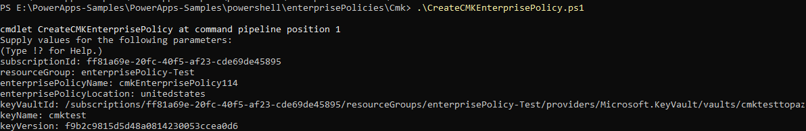 

Sample Output :  
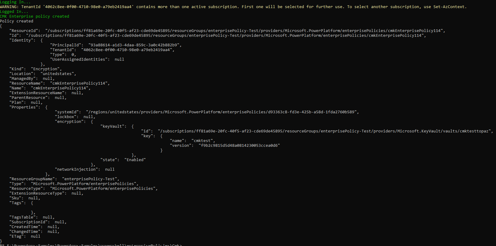 

2. **Get CMK Enterprise Policy By ResourceId** : The script gets a CMK enterprise policy by ARM resourceId 
Script name : GetCMKEnterprisePolicyByResourceId.ps1 
Input parameter :
    - enterprisePolicyArmId : The ARM resource ID of the CMK Enterprise Policy

Sample Input : 
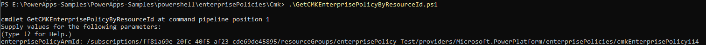 

Sample Output : 
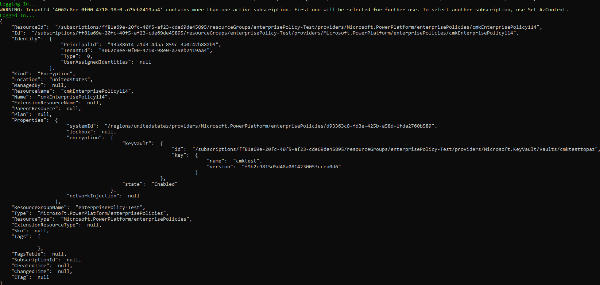 

3. **Get CMK Enterprise Policies in Subscription** : The script gets all CMK enterprise policies in an Azure subscription 
Script name : GetCMKEnterprisePoliciesInSubscription.ps1 
Input parameter :
    - subscriptionId: : The Azure subscription Id

Sample Input : 
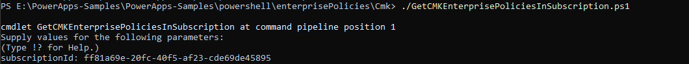 

Sample Output : 
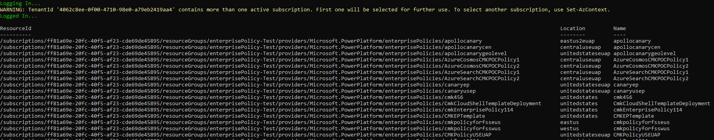 

4. **Get CMK Enterprise Policies in Resource Group** : The script gets all CMK enterprise policies in an Azure resource group 
Script name : GetCMKEnterprisePoliciesInResourceGroup.ps1 
Input parameters :
    - subscriptionId : The Azure subscription Id
    - resourceGroup : The Azure resource group

Sample Input :  
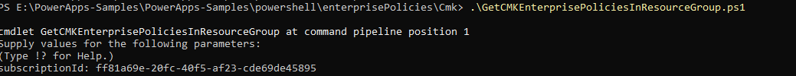 

Sample Output : 
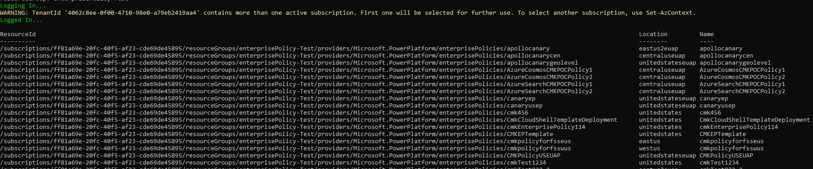 

5. **Validate Azure Key Vault** : This script checks if the Key Vault is setup correctly according to the pre-requisites required by the Power Platform CMK Enterprise Policy 
    - Soft-delete : if not enabled, then a warning message is displayed (soft-delete is a read only property and can’t be fixed). Follow the instructions at
      https://docs.microsoft.com/en-us/azure/key-vault/general/soft-delete-change to update the soft delete property.
    - Purge protection - if not enabled, then enables it for the customer
    - Adds the access policies to the Key Vault with permission GET, UNWRAPKEY, WRAPKEY for the given enterprise policy 

Script name : ValidateKeyVaultForCMK.ps1 
Input parameters :
    - subscriptionId : The Azure subscription Id of the Key Vault
    - keyVaultName : The name of the key Vault
    - enterprisePolicyArmId : The CMK enterprise policy ARM Id which should have permission GET, UNWRAPKEY, WRAPKEY for the key vault

Sample Input :  
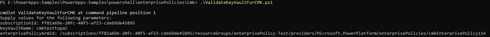 

Sample Output : 
 

6. **Update CMK Enterprise Policy** : This script updates a CMK Enterprise Policy. The updates allowed are for keyVaultId, keyName, keyVersion. 
If you are changing only some of the allowed parameter values, provide “N/A” when prompted for the parameters that you don’t want to change. 
 **If the enterprise policy is associated with one or more environments, the update operation will fail, and the script will return an error.** 
Script name : UpdateCMKEnterprisePolicy.ps1 
Input parameters :
    - subscriptionId : The Azure subscription Id of the CMK Enterprise Policy
    - resourceGroup : The Azure resource group of the CMK Enterprise Policy
    - enterprisePolicyName : The name of the CMK enterprise policy that needs to be updated
    - keyVaultId : The ARM resource ID of the key vault if it needs to be updated. Provide "N/A" if update is not required for key vault Id
    - keyName: The name of the key if it needs to be updated. Provide "N/A" if update is not required for name of the key
    - keyVersion: The version of the key if it needs to be updated. Provide "N/A" if update is not required for version of the key

Sample Input :  
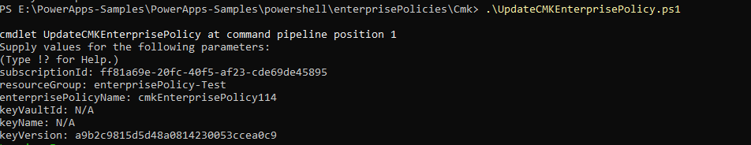 

Sample Output : 
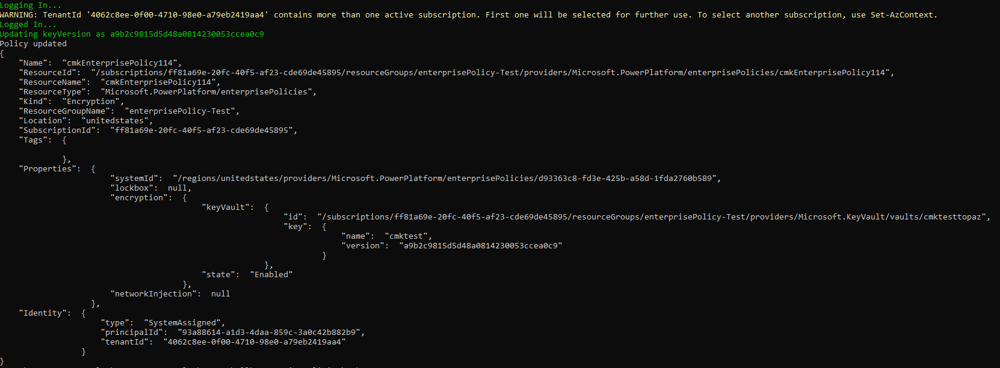 

7. **Delete CMK Enterprise Policy** : This script deletes the CMK Enterprise Policy for a given policy Id.  
**If the CMK enterprise policy is associated with one or more environments, the delete operation will fail, and the script will return an error.** 
Script name : RemoveCMKEnterprisePolicy.ps1 
Input parameter :
    - policyArmId : The ARM ID of the CMK enterprise policy to be deleted

Sample Input :  
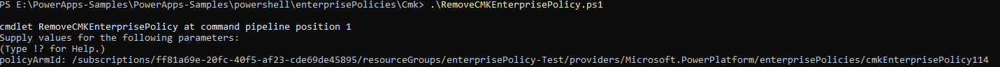 

Sample Output : 
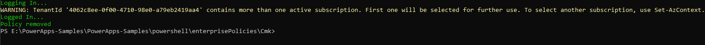 

8. **Set CMK for an environment** : This script applies a CMK enterprise policy to a given Power Platform environment. 
The script adds the environment to the enterprise policy and optionally polls for the operation outcome. 
Script name : AddCustomerManagedKeyToEnvironment.ps1 
Input parameters :
    - environmentId : The Power Platform environment ID
    - policyArmId : The ARM ID of the CMK Enterprise Policy

Sample Input : 
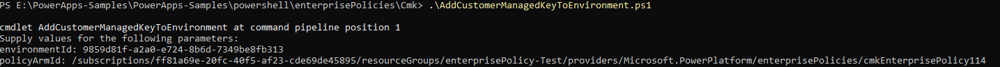 

Sample Output : 
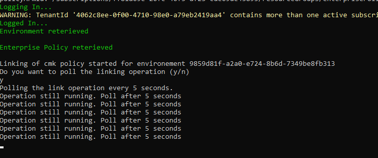 

9. **Get CMK for an environment** : This script returns the CMK enterprise policy if applied to a given Power Platform environment. 
Script name : GetCMKEnterprisePolicyForEnvironment.ps1 
Input parameter :
    - environmentId : The Power Platform environment ID

Sample Input : 
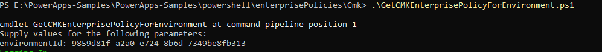 

Sample Output : 
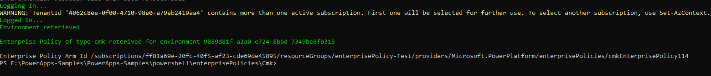 

10. **Remove CMK from an environment** : The script removes the CMK enterprise policy from an environment,  
which results on data to be encrypted with a Microsoft managed encryption key. 
Script name : RemoveCustomerManagedKeyFromEnvironment.ps1 
Input parameters :
    - environmentId : The Power Platform environment ID
    - policyArmId: The ARM ID of the CMK Enterprise Policy

Sample Input : 
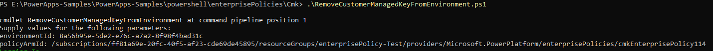 

Sample Output : 
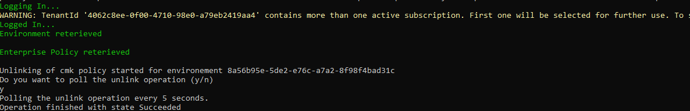 
